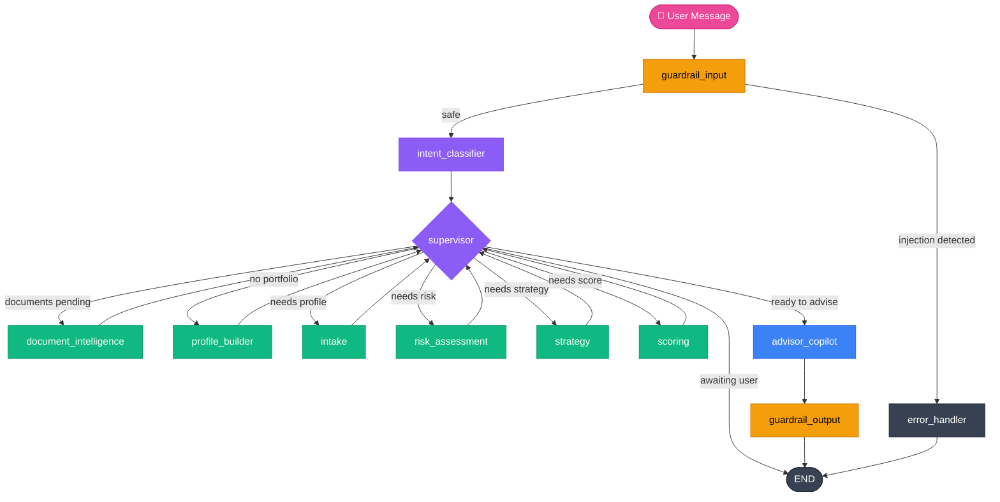

# Financial Advisory Agentic System

A production-grade multi-agent LLM system for personalized financial advisory. Users upload brokerage statements or describe their portfolio; the system runs a full quantitative analysis pipeline — risk assessment, portfolio optimization, composite scoring — then delivers a RAG-grounded advisory response backed by 41 authoritative financial documents and live market data.

---

<div align="center">

| [📦 Setup](docs/setup.md) | [🏗 Architecture](docs/architecture.md) | [🤖 Agents](docs/agents.md) | [🔍 RAG](docs/rag.md) | [📊 Evals](docs/evals.md) | [🔭 Observability](docs/observability.md) | [📈 Market Data](docs/market-data.md) | [🔌 API](docs/api.md) | [🖥 Frontend](docs/frontend.md) |
|:---:|:---:|:---:|:---:|:---:|:---:|:---:|:---:|:---:|

</div>

---

## Table of Contents

- [Features](#features)
- [Architecture](#architecture)
- [Tech Stack](#tech-stack)
- [Quick Start](#quick-start)
- [Environment Variables](#environment-variables)

---

## Features

- **Intent-aware routing** — classifies every message into one of 4 intents (`general`, `risk_analysis`, `score_portfolio`, `full_analysis`) and runs only the pipeline stages that intent requires
- **Document intelligence** — upload a PDF brokerage statement; the system extracts holdings, normalizes weights, and skips the manual intake conversation entirely
- **Full quantitative pipeline** — Sharpe ratio, annualized volatility, max drawdown, max-Sharpe portfolio optimization via PyPortfolioOpt, composite portfolio scoring (0–100)
- **Hybrid RAG** — pgvector cosine search + PostgreSQL BM25 full-text search merged by Reciprocal Rank Fusion; 41 authoritative financial documents (~1429 chunks)
- **Live market data** — yfinance OHLCV, Alpha Vantage fundamentals + news sentiment, FRED macroeconomic indicators; all Redis-cached with per-source TTLs
- **Real-time SSE streaming** — token-level streaming from `advisor_copilot` with per-agent progress events visible in the UI
- **Langfuse observability** — every node is traced; LLM token counts and USD cost visible per span; RAG retrieval chunks logged as span metadata
- **4-tier eval suite** — unit → integration → RAG retrieval quality (MRR, precision@3) → LLM-as-judge (deepeval faithfulness, answer relevancy)
- **PII + injection guardrails** — SSN, phone, email, credit card masking; 11 prompt injection pattern detections at both input and output

---

## Architecture



The graph is a LangGraph `StateGraph` with PostgreSQL checkpointing. Every message is persisted so sessions resume exactly where they left off across browser refreshes and reconnects.

**Intent-gated pipeline stages:**

| Intent | Intake | Risk Assessment | Strategy | Scoring |
|--------|:------:|:---------------:|:--------:|:-------:|
| `general` | — | — | — | — |
| `risk_analysis` | ✓ | ✓ | — | — |
| `score_portfolio` | ✓ | ✓ | — | ✓ |
| `full_analysis` | ✓ | ✓ | ✓ | ✓ |

---

## Tech Stack

| Layer | Technology |
|-------|-----------|
| API server | FastAPI 0.115, Python 3.12, uvicorn |
| Agent framework | LangGraph 0.4, LangChain 0.3 |
| LLM routing | OpenRouter (openai-compatible endpoint) |
| Embeddings | fastembed — BAAI/bge-small-en-v1.5 (384-dim, local inference) |
| Portfolio math | PyPortfolioOpt, pandas, numpy |
| Primary database | PostgreSQL 16 + pgvector extension |
| Document store | MongoDB 7 |
| Cache | Redis 7 |
| Market data | yfinance, Alpha Vantage, FRED (St. Louis Fed) |
| Observability | Langfuse |
| Evaluations | deepeval, pytest |
| Frontend | Next.js 16, React 19, TypeScript, Tailwind CSS |
| Markdown rendering | react-markdown 10, remark-gfm |

---

## Quick Start

```bash
# 1. Clone and configure
git clone <repo-url> && cd financial-advisory-agentic-system
cp .env.example .env        # fill in API keys

# 2. Start infrastructure
docker compose up -d

# 3. Backend
cd backend
uv sync
uv run alembic upgrade head
cd .. && cd rag_knowledge_base && python download_pdfs.py && cd ../backend
uv run python scripts/seed_kb.py
uv run uvicorn app.main:app --reload    # http://localhost:8000

# 4. Frontend (separate terminal)
cd frontend && npm install && npm run dev   # http://localhost:3000
```

See **[📦 Setup](docs/setup.md)** for the complete guide including API key acquisition and test commands.

---

## Environment Variables

| Variable | Required | Description |
|----------|:--------:|-------------|
| `DATABASE_URL` | ✓ | PostgreSQL asyncpg connection string |
| `MONGODB_URL` | ✓ | MongoDB connection string |
| `REDIS_URL` | ✓ | Redis connection string |
| `OPENROUTER_API_KEY` | ✓ | All LLM calls — get at openrouter.ai/keys |
| `OPENROUTER_MODEL` | ✓ | Model ID (e.g. `meta-llama/llama-3.3-70b-instruct:free`) |
| `ALPHA_VANTAGE_API_KEY` | ✓ | Fundamentals + news sentiment data |
| `FRED_API_KEY` | ✓ | Macroeconomic indicators (DGS3MO, CPIAUCSL, T10Y2Y) |
| `LANGFUSE_PUBLIC_KEY` | optional | Observability tracing — system no-ops without it |
| `LANGFUSE_SECRET_KEY` | optional | Observability tracing |
| `LANGFUSE_HOST` | optional | Default: `https://cloud.langfuse.com` |
| `APP_ENV` | optional | `development` or `production` |
| `LOG_LEVEL` | optional | `INFO` (default) |

> **Note**: `DATABASE_URL`, `MONGODB_URL`, and `REDIS_URL` must use `localhost` (not Docker service names) when running the backend with `uv run uvicorn` outside Docker.
